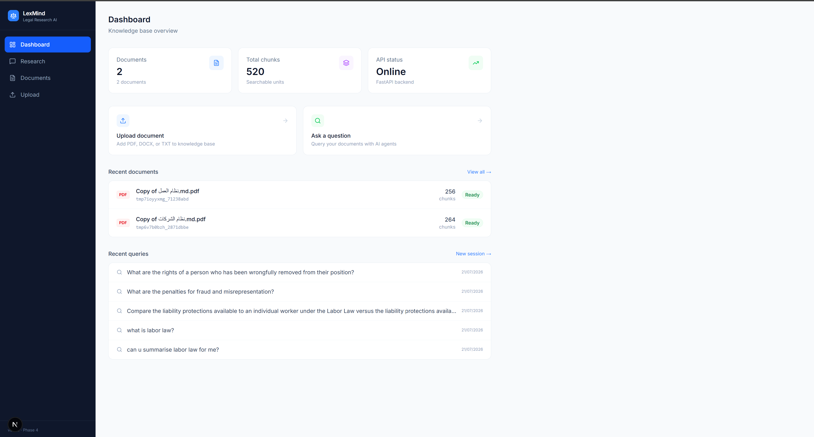

# LexMind

> AI-powered legal research assistant. Upload legal documents, ask questions in plain English, and get grounded answers with article citations — every claim verified before it reaches you.


---

## Dashboard




---

## What Is LexMind?

LexMind is a multi-agent AI system for legal document research.
Upload a contract, law, or any legal document. Ask a question in plain English.
Four specialized AI agents work in sequence to find the most relevant sections,
generate a grounded answer, and verify its quality before returning it to you.

Every answer is:
- Grounded **strictly** in the uploaded document — no hallucination
- Cited with the exact article number **and** the law name e.g. `[Article 75 — Labor Law]`
- Scored on groundedness, citation accuracy, and relevance
- Aware of the full conversation history for coherent follow-up questions

---

## Features

| Feature | Description |
|---|---|
| **Document ingestion** | Upload PDF, DOCX, or TXT — parsed, chunked by article boundary, embedded, stored |
| **Auto title detection** | 3-step cascade: extract from document → LLM identification → filename fallback |
| **Hybrid search** | Dense E5-large vectors + BM25 keyword search + cross-encoder reranking |
| **Multi-agent pipeline** | Orchestrator → Retrieval → Reasoning → Critic via LangGraph |
| **Law-name citations** | Every claim cited as `Article 75 — Labor Law` not just `Article 75` |
| **Quality scoring** | Groundedness, citation accuracy, relevance scored on every answer |
| **Research sessions** | Persistent multi-turn conversations with full conversation history |
| **Session export** | Download any research session as a markdown file |
| **Document management** | Upload, update (re-ingest), delete — BM25 index rebuilds automatically |
| **Query history** | Dashboard shows recent queries across all sessions |
| **Multi-document** | Search across all documents or restrict to a specific one |

---

## How It Works

### Ingestion Pipeline — 5 Stations

A raw document enters one end. A searchable, persistent knowledge base comes out the other.

```
Raw Document (PDF / DOCX / TXT)
        ↓
Station 1 — Parser
        Reads the file. Identifies structure.
        Labels each line as heading (level 1/2/3) or paragraph.
        Uses Docling as primary parser with pypdf/python-docx fallback.
        ↓
Station 2 — Chunker
        Groups elements by article boundary.
        Article 47 and all its sub-clauses stay together in one chunk.
        Splits oversized articles with configurable overlap.
        ↓
Station 3 — Embedder
        Converts each chunk to a 1024-dimensional vector using E5-large.
        Uses passage: prefix for chunks, query: prefix for search queries.
        Processes in batches. Lazy-loads model on first use.
        ↓
Station 4 — Vector Store
        Stores vectors + text + metadata permanently in ChromaDB on disk.
        Stores doc_title in every chunk for law-name citations.
        Embed once. Search forever.
        ↓
Station 5 — BM25 Index
        Rebuilds keyword search index from all ChromaDB chunks.
        Runs automatically after every upload or re-ingestion.
        ↓
Knowledge Base — persistent, searchable, always up to date
```

### Query Pipeline — 4 Agents

Four agents run in sequence for every question.

```
User Question
        ↓
Orchestrator Agent
        Classifies the query type:
        factual | analytical | comparison | summarisation
        Selects the right retrieval strategy and prompt template.
        ↓
Retrieval Agent
        Step 1: Dense search via ChromaDB (semantic similarity — up to 20 results)
        Step 2: BM25 keyword search (exact term matching — up to 20 results)
        Step 3: Merge + deduplicate (up to 40 unique candidates)
        Step 4: Cross-encoder reranking → top 5 chunks returned
        ↓
Reasoning Agent
        Formats chunks as labelled context (includes doc_title in each excerpt header).
        Calls LLM with grounding prompt enforcing citations with law name.
        Normalises written article numbers to digits (Seventy-Five → 75).
        Parses citations from the response.
        Uses conversation history for coherent follow-up answers.
        ↓
Critic Agent
        Scores the answer on three dimensions (0.0–1.0):
          Groundedness     — is every claim supported by a retrieved chunk?
          Citation Accuracy — are the article numbers and law names correct?
          Relevance        — does the answer address the question asked?
        If any score is below threshold → reject and regenerate (max 2 times).
        ↓
Final Answer — grounded, cited with law name, quality-verified
```

---

## Tech Stack

| Layer | Technology | Purpose |
|---|---|---|
| Embeddings | intfloat/multilingual-e5-large | 1024-dim vectors, 93 languages, runs locally — no API cost |
| Vector DB | ChromaDB | Persistent on-disk vector storage and cosine similarity search |
| Keyword Search | rank-bm25 | BM25 keyword search, auto-rebuilds on every document upload |
| Reranking | cross-encoder/ms-marco-MiniLM-L-6-v2 | Reranks top-40 candidates to select best 5 |
| Agent Framework | LangGraph | Multi-agent graph with conditional routing and shared TypedDict state |
| LLM | Google Gemini / OpenAI / Anthropic | Configurable via .env — classification, reasoning, critique |
| Backend | FastAPI + SQLAlchemy | REST API with Pydantic validation and auto-generated Swagger docs |
| Database | SQLite | Persistent chat sessions and message history |
| Frontend | Next.js 16 + TypeScript + Tailwind CSS | React application with global upload context |

---

## Project Structure

```
LexMind/
├── src/
│   ├── ingestion/
│   │   ├── parser.py              # PDF/DOCX/TXT parser with heading detection
│   │   ├── chunker.py             # Legal-aware article-boundary chunker
│   │   ├── embedder.py            # E5-large embedder with lazy loading
│   │   ├── vector_store.py        # ChromaDB wrapper with similarity search
│   │   ├── ingestion_pipeline.py  # Orchestrates all 5 stations in one call
│   │   ├── title_extractor.py     # 3-step document title detection cascade
│   │   └── number_utils.py        # Word-to-number citation normalisation
│   ├── agents/
│   │   ├── orchestrator.py        # Query type classification
│   │   ├── retrieval_agent.py     # Hybrid dense+BM25 search + cross-encoder
│   │   ├── reasoning_agent.py     # Grounded answer generation with law citations
│   │   └── critic_agent.py        # Quality scoring and rejection loop
│   ├── graph/
│   │   ├── state.py               # LexMindState TypedDict (shared agent state)
│   │   └── graph.py               # LangGraph wiring and run_query()
│   ├── api/
│   │   ├── main.py                # FastAPI app, CORS, startup events
│   │   ├── schemas.py             # Pydantic request/response models
│   │   └── routes/
│   │       ├── ingest.py          # POST /api/ingest, PUT /api/documents/{id}/reingest
│   │       ├── query.py           # POST /api/query
│   │       ├── documents.py       # GET/DELETE /api/documents
│   │       └── sessions.py        # CRUD sessions + messages + export
│   └── db/
│       ├── database.py            # SQLAlchemy engine and session factory
│       └── models.py              # Session and Message ORM models
├── tests/
│   ├── ingestion/                 # 44 tests
│   └── agents/                    # 42 tests
├── frontend/
│   ├── app/
│   │   ├── page.tsx               # Dashboard with stats + recent queries
│   │   ├── research/page.tsx      # Chat interface with session history + export
│   │   ├── documents/page.tsx     # Document table with Update/Query/Delete
│   │   └── upload/page.tsx        # Upload with title input + persistent progress
│   ├── components/
│   │   ├── Sidebar.tsx            # Navigation + global upload progress indicator
│   │   └── ChatMessage.tsx        # Message bubble with citation pills + scores
│   ├── contexts/
│   │   └── UploadContext.tsx      # Global upload state — persists across navigation
│   └── lib/
│       └── api.ts                 # TypeScript API client for all endpoints
├── data/                          # ChromaDB, BM25 index, SQLite (gitignored)
├── docs/
│   └── screenshots/               # Place dashboard.png here
├── .env.example
├── pyproject.toml
└── requirements.txt
```

---

## Getting Started

### Prerequisites

- Python 3.11+
- Node.js 18+

### 1. Clone and configure

```bash
git clone https://github.com/SajidAli8015/LexMind.git
cd LexMind
cp .env.example .env
```

Edit `.env` and add your LLM API key:

```env
LLM_PROVIDER=google
GOOGLE_API_KEY=your_key_here
```

### 2. Python setup

```bash
python -m venv venv
.\venv\Scripts\activate        # Windows
pip install -r requirements.txt
pip install -e .
```

### 3. Frontend setup

```bash
cd frontend
npm install
cd ..
```

### 4. Start backend

```bash
uvicorn src.api.main:app --reload --port 8000
```

- API: http://localhost:8000
- Swagger UI: http://localhost:8000/docs
- Health check: http://localhost:8000/health

### 5. Start frontend

```bash
cd frontend
npm run dev
```

Open http://localhost:3000

> **Important:** Always stop uvicorn with Ctrl+C before closing the terminal.
> Closing the window without Ctrl+C leaves orphan processes holding port 8000.
> Fix: `netstat -ano | findstr :8000` then `taskkill /PID <id> /F`

---

## Environment Variables

| Variable | Default | Description |
|---|---|---|
| LLM_PROVIDER | google | LLM provider: google, openai, anthropic, azure |
| GOOGLE_API_KEY | — | Google Gemini API key |
| OPENAI_API_KEY | — | OpenAI API key |
| ANTHROPIC_API_KEY | — | Anthropic API key |
| EMBEDDING_MODEL | intfloat/multilingual-e5-large | HuggingFace embedding model |
| EMBEDDING_DEVICE | cpu | cpu, cuda, or mps (Apple Silicon) |
| CHUNK_SIZE | 1500 | Max characters per chunk before splitting |
| CHUNK_OVERLAP | 150 | Overlap characters between sub-chunks |
| TOP_K_FINAL | 5 | Final chunks returned after reranking |
| MAX_CHUNKS_DENSE | 20 | Dense search candidates before reranking |
| MAX_CHUNKS_BM25 | 20 | BM25 search candidates before reranking |
| GROUNDEDNESS_THRESHOLD | 0.75 | Minimum groundedness score to pass Critic |
| CITATION_THRESHOLD | 0.85 | Minimum citation accuracy score to pass |
| RELEVANCE_THRESHOLD | 0.70 | Minimum relevance score to pass |
| MAX_REGENERATIONS | 2 | Max Critic rejections before accepting |
| CHROMA_DB_PATH | ./data/chroma_db | ChromaDB storage directory |
| BM25_INDEX_PATH | ./data/bm25_index.pkl | BM25 keyword index file |
| SESSIONS_DB_PATH | ./data/sessions.db | SQLite sessions database |

---

## API Reference

| Method | Endpoint | Description |
|---|---|---|
| POST | /api/ingest | Upload PDF/DOCX/TXT — runs full 5-station ingestion pipeline |
| POST | /api/query | One-shot query — runs agent pipeline, returns answer + quality scores |
| GET | /api/documents | List all ingested documents with chunk counts and titles |
| DELETE | /api/documents/{doc_id} | Remove document and all its chunks from ChromaDB |
| PUT | /api/documents/{doc_id}/reingest | Replace document with updated version — auto-rebuilds BM25 |
| POST | /api/sessions | Create a new research session |
| GET | /api/sessions | List all sessions sorted by most recently updated |
| GET | /api/sessions/{id} | Get session with full message history |
| POST | /api/sessions/{id}/message | Send message — agent pipeline with conversation context |
| GET | /api/sessions/{id}/export | Export session as downloadable markdown file |
| DELETE | /api/sessions/{id} | Delete session and all its messages |
| GET | /api/sessions/recent-queries | Recent user queries across all sessions (for dashboard) |
| GET | /health | API status and knowledge base statistics |

Full interactive documentation: http://localhost:8000/docs

---

## Tests

86 tests total. All tests run in under 2 seconds — deterministic logic,
no LLM calls, no network requests, no file I/O.

```bash
python -m pytest tests/ -v              # all 86 tests
python -m pytest tests/ingestion/ -v   # 44 ingestion tests
python -m pytest tests/agents/ -v      # 42 agent tests
```

| File | Tests | Covers |
|---|---|---|
| tests/ingestion/test_parser.py | 7 | Parsing, heading detection, element classification |
| tests/ingestion/test_chunker.py | 7 | Article-boundary chunking, overlap, doc_id generation |
| tests/ingestion/test_embedder.py | 8 | E5 embedding, query/passage prefixes, semantic similarity |
| tests/ingestion/test_vector_store.py | 10 | ChromaDB storage, search, metadata filtering, delete |
| tests/ingestion/test_pipeline.py | 8 | End-to-end ingestion, BM25 rebuild, duplicate handling |
| tests/agents/test_state.py | 5 | LexMindState creation and field defaults |
| tests/agents/test_orchestrator.py | 8 | Query classification, JSON parsing, fallback |
| tests/agents/test_reasoning_agent.py | 12 | Citation extraction, chunk formatting, prompt templates |
| tests/agents/test_critic_agent.py | 10 | Score parsing, feedback composition, threshold checks |
| tests/agents/test_graph.py | 7 | Routing logic, graph compilation, conditional edges |

---

## Key Design Decisions

**Grounded answers only**
The LLM is forbidden from using knowledge outside the retrieved chunks.
Every claim must be cited. If the document does not contain the answer,
LexMind says so — it never hallucinates.

**Law-name citations**
When multiple documents are loaded, citations include the law name:
`[Article 75 — Labor Law]` not just `[Article 75]`.
The doc_title is stored in ChromaDB metadata during ingestion and
included in every chunk's context header sent to the LLM.

**Hybrid search**
Dense vector search finds semantically similar chunks even when words differ.
BM25 finds exact article references and specific terms.
A cross-encoder reranks the merged top-40 to select the best 5.
BM25 index rebuilds automatically after every document upload.

**Session memory without polluting retrieval**
Conversation history is passed to the Reasoning Agent for coherent answers.
But retrieval always uses the raw question only — not the enriched history.
This prevents previous questions from biasing vector search toward earlier topics.

**Critic loop**
After the Reasoning Agent generates an answer the Critic scores it.
If any score falls below its threshold the answer is rejected and
regenerated with specific feedback — up to MAX_REGENERATIONS times.

**Lazy loading**
The E5 model (1.3 GB) loads only on the first ingestion call.
ChromaDB connects only on the first request.
Startup is instant — no blocking on model load.

**Global upload context**
Upload state lives in a React Context at the layout level.
Navigating away during upload does not cancel the request.
The sidebar shows upload progress regardless of which page you are on.

---

## License

MIT

---

*Built with LangGraph, FastAPI, ChromaDB, and Next.js*
